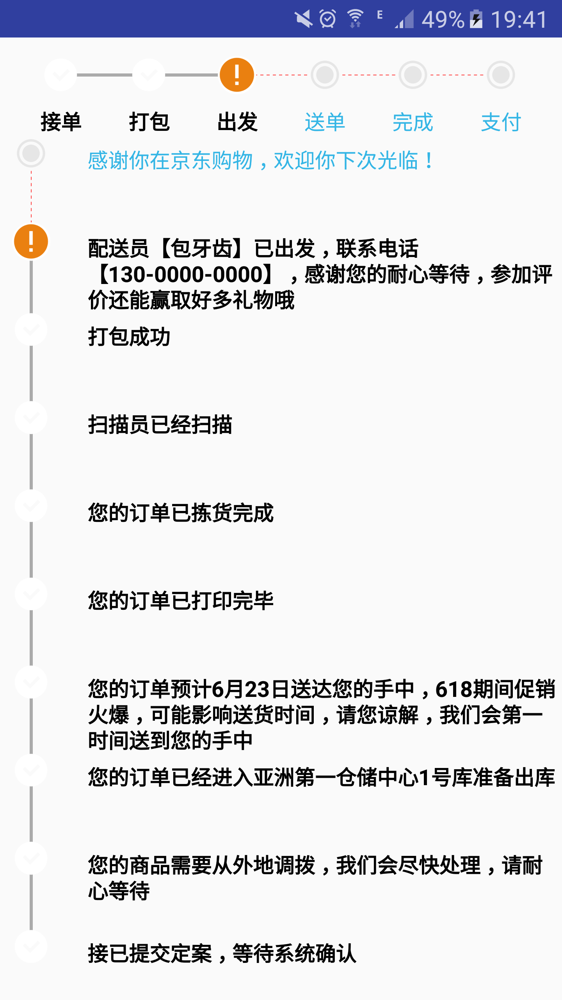

# LogisticsStepView
一个线性的物流展示控件，转载自：http://www.jianshu.com/p/df03c1276121

use HorizontalStepView
in xml

    <com.baoyachi.stepview.HorizontalStepView
            android:id="@+id/step_view0"
            android:layout_width="match_parent"
            android:layout_height="wrap_content"
            android:layout_centerInParent="true"
            android:textColor="@android:color/white"
            android:textSize="14sp"
            />
            
in java

 HorizontalStepView setpview0 = (HorizontalStepView) mView.findViewById(R.id.step_view0);
        List<String> list0 = new ArrayList<>();
        list0.add("接单");
        list0.add("打包");
        list0.add("出发");
        list0.add("送单");
        list0.add("完成");
        list0.add("支付");
        setpview0.setStepsViewIndicatorComplectingPosition(2)//设置完成的步数
                .setStepViewTexts(list0)//总步骤
                .setStepsViewIndicatorCompletedLineColor(ContextCompat.getColor(getActivity(), android.R.color.white))//设置StepsViewIndicator完成线的颜色
                .setStepsViewIndicatorUnCompletedLineColor(ContextCompat.getColor(getActivity(), R.color.uncompleted_text_color))//设置StepsViewIndicator未完成线的颜色
                .setStepViewComplectedTextColor(ContextCompat.getColor(getActivity(), android.R.color.white))//设置StepsView text完成线的颜色
                .setStepViewUnComplectedTextColor(ContextCompat.getColor(getActivity(), R.color.uncompleted_text_color))//设置StepsView text未完成线的颜色
                .setStepsViewIndicatorCompleteIcon(ContextCompat.getDrawable(getActivity(), R.drawable.complted))//设置StepsViewIndicator CompleteIcon
                .setStepsViewIndicatorDefaultIcon(ContextCompat.getDrawable(getActivity(), R.drawable.default_icon))//设置StepsViewIndicator DefaultIcon
                .setStepsViewIndicatorAttentionIcon(ContextCompat.getDrawable(getActivity(), R.drawable.attention));//设置StepsViewIndicator AttentionIcon

in xml

    <com.baoyachi.stepview.VerticalStepView
            android:id="@+id/step_view0"
            android:layout_width="wrap_content"
            android:layout_height="match_parent"
            android:text="vertical setpview"
            />
            
in java

mSetpview0 = (VerticalStepView) mView.findViewById(R.id.step_view0);

        List<String> list0 = new ArrayList<>();
        list0.add("接已提交定案，等待系统确认");
        list0.add("您的商品需要从外地调拨，我们会尽快处理，请耐心等待");
        list0.add("您的订单已经进入亚洲第一仓储中心1号库准备出库");
        list0.add("您的订单预计6月23日送达您的手中，618期间促销火爆，可能影响送货时间，请您谅解，我们会第一时间送到您的手中");
        list0.add("您的订单已打印完毕");
        list0.add("您的订单已拣货完成");
        list0.add("扫描员已经扫描");
        list0.add("打包成功");
        list0.add("配送员【包牙齿】已出发，联系电话【130-0000-0000】，感谢您的耐心等待，参加评价还能赢取好多礼物哦");
        list0.add("感谢你在京东购物，欢迎你下次光临！");
        mSetpview0.setStepsViewIndicatorComplectingPosition(list0.size() - 2)//设置完成的步数
                .setStepViewTexts(list0)//总步骤
                .setStepsViewIndicatorCompletedLineColor(ContextCompat.getColor(getActivity(), android.R.color.white))//设置StepsViewIndicator完成线的颜色
                .setStepsViewIndicatorUnCompletedLineColor(ContextCompat.getColor(getActivity(), R.color.uncompleted_text_color))//设置StepsViewIndicator未完成线的颜色
                .setStepViewComplectedTextColor(ContextCompat.getColor(getActivity(), android.R.color.white))//设置StepsView text完成线的颜色
                .setStepViewUnComplectedTextColor(ContextCompat.getColor(getActivity(), R.color.uncompleted_text_color))//设置StepsView text未完成线的颜色
                .setStepsViewIndicatorCompleteIcon(ContextCompat.getDrawable(getActivity(), R.drawable.complted))//设置StepsViewIndicator CompleteIcon
                .setStepsViewIndicatorDefaultIcon(ContextCompat.getDrawable(getActivity(), R.drawable.default_icon))//设置StepsViewIndicator DefaultIcon
                .setStepsViewIndicatorAttentionIcon(ContextCompat.getDrawable(getActivity(), R.drawable.atte
效果图

原文链接：http://www.jianshu.com/p/df03c1276121
